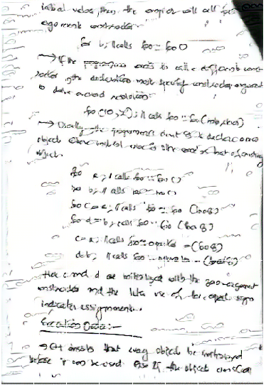

# copycat
CNN Style Transfer AI which will copy the content of an assignment and "rewrite" it using a target handwriting

[Open with Colab](https://colab.research.google.com/github/devpranoy/copycat/blob/master/copycat.ipynb)
# Handwriting

  
  
 

# Assignment

  
  

# Output

After 5 iterations 

  
  

