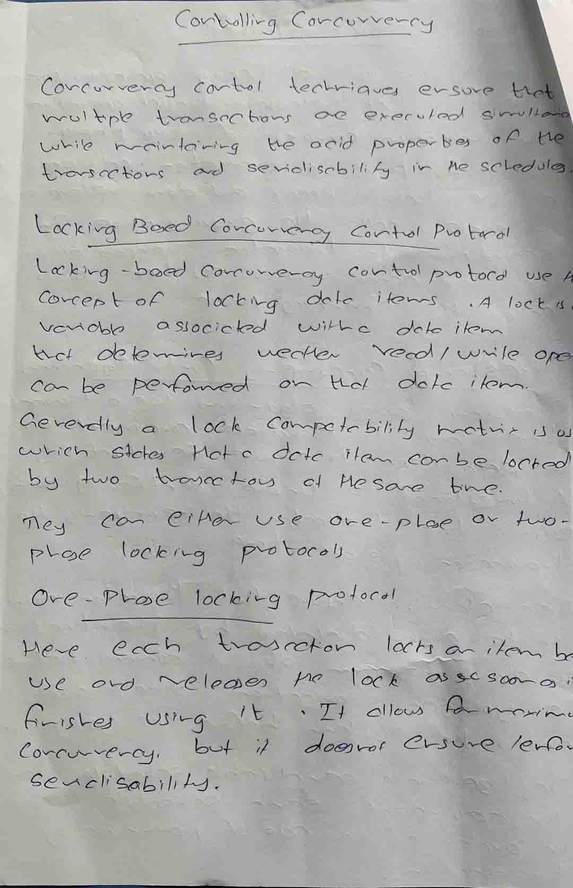
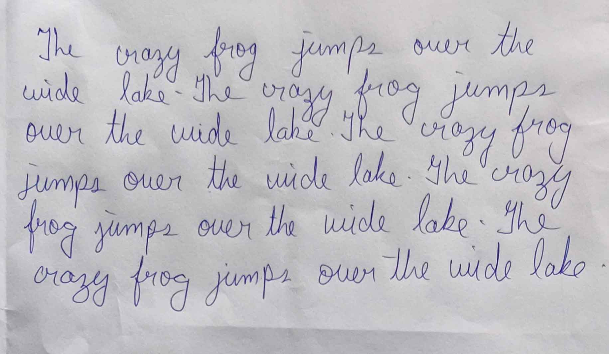

# copycat
CNN Style Transfer AI which will copy the content of an assignment and "rewrite" it using a target handwriting

[Open with Colab](https://colab.research.google.com/github/devpranoy/copycat/blob/master/copycat.ipynb)

  
  
  
  

  
Handwriting

Assignemnt

